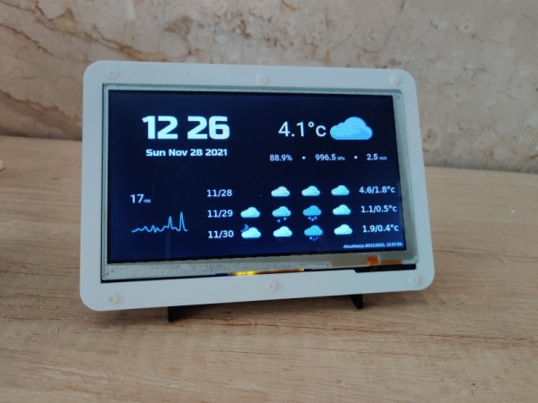

# Simple Weather Station

A simple Raspberry-pi based weather station with network latency.



## Hardware

This project has been built and tested with the following hardware components:
* Raspberry Pi 3 model B
* WaveShare 7inch Capacitive Touch Screen LCD (B), 800×480 (10829)

## OS setup

Install Raspberry Pi OS Lite using `rpi-imager`. The project has been tested with version 10 (buster).

If you are not using ethernet connection, use `raspi-config` to setup WiFi.

The project uses minimum xserver config with OpenBox, a lightweight window manager. Install `xserver` and `openbox`:
```
sudo apt-get install --no-install-recommends xserver-xorg x11-xserver-utils xinit openbox
```

## Screen setup

Edit `/boot/config.txt` to setup the screen:
```
max_usb_current=1
hdmi_group=2
hdmi_mode=87
hdmi_cvt 800 480 60 6 0 0 0
hdmi_drive=1
```
Since the project is using screen in landscape mode, rotate touch screen. To do this edit `/etc/xdg/openbox/autostart`:
```
xinput set-prop 'WaveShare WS170120' 'Coordinate Transformation Matrix' 0 1 0 -1 0 1 0 0 1
```
## Setup network measurment
The project is measuring network latency using telegraf's `ping` plugin configured to ping CloudFlare's `1.1.1.1` DNS server and storing result in InfluxDB cloud. You can change settings to your preference.

You'll need to either setup InfluxDB cloud acount (free tiers are available) or install InfluxDB yourself.

To setup telegraf, run the following commands:
```
sudo apt-get install -y telegraf
```

Copy configuration from `scripts/telegraf.conf` to `/etc/telegraf/telegraf.conf` and edit the following entries to point to your influxdb instance. Put values from your influxdb configuration:
```
[[outputs.influxdb_v2]]
urls = 
token = 
organization = 
bucket = 
```

Then enable telegraf:

```
sudo systemctl enable telegraf
sudo systemctl start telegraf
```
## Weather data
The project is using Yr service from [NRK and Norwegian Meteorological Institute](https://www.yr.no/en)

Location for which data is displayed can be edited in the configuration described below. You will also need to provide User Agent string (`YR_USR_AGENT`) that will include name of your instance and your email address.

For details of what is required to use Yr please refer to: https://developer.yr.no/doc/TermsOfService/
## Configure project
Copy `config.txt` to `~/.weatherst` and add your own account details:
```
INFLUXDB_TOKEN=
INFLUXDB_ORG=
INFLUXDB_URL=
YR_USR_AGENT=
YR_LAT=
YR_LON=
```
## Build project
The project is based on [Electron](https://www.electronjs.org/) and [React](https://reactjs.org/). To build it you need to install [Node.js](https://nodejs.org/en/) version 15 at minimum.

Once installed, download dependencies
```
npm install
```

And build the project
```
npm run package
```
## Autostart

To setup autostart edit `/etc/xdg/openbox/autostart`. Add the following:
```
# Disable any form of screen saver / screen blanking / power management
xset s off
xset s noblank
xset -dpms

# Allow quitting the X server with CTRL-ATL-Backspace
setxkbmap -option terminate:ctrl_alt_bksp

# Start your app
/home/pi/weatherst/out/weatherst-linux-armv7l/weatherst
```